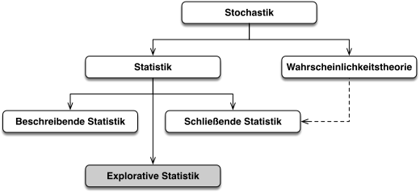
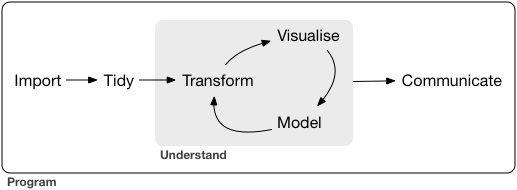
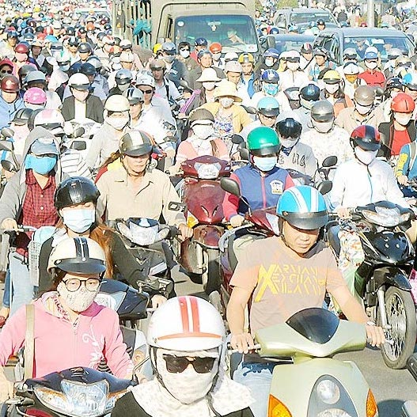
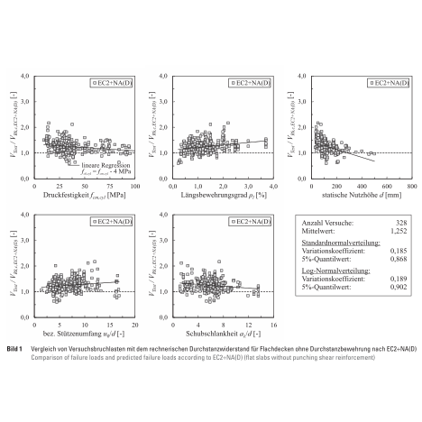
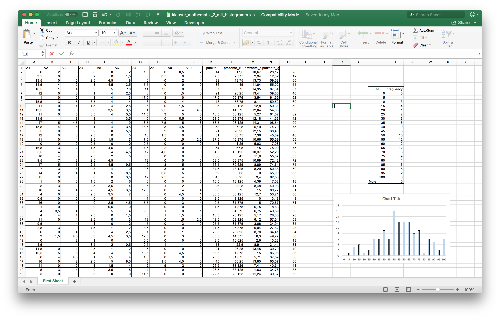
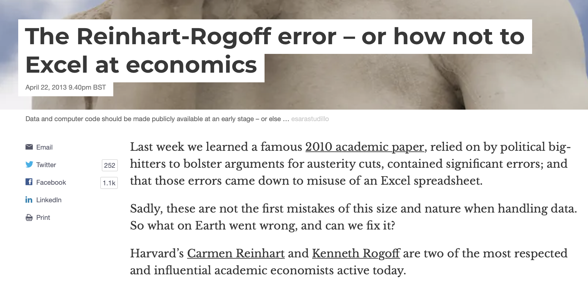
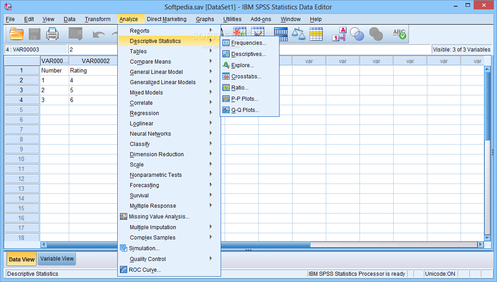
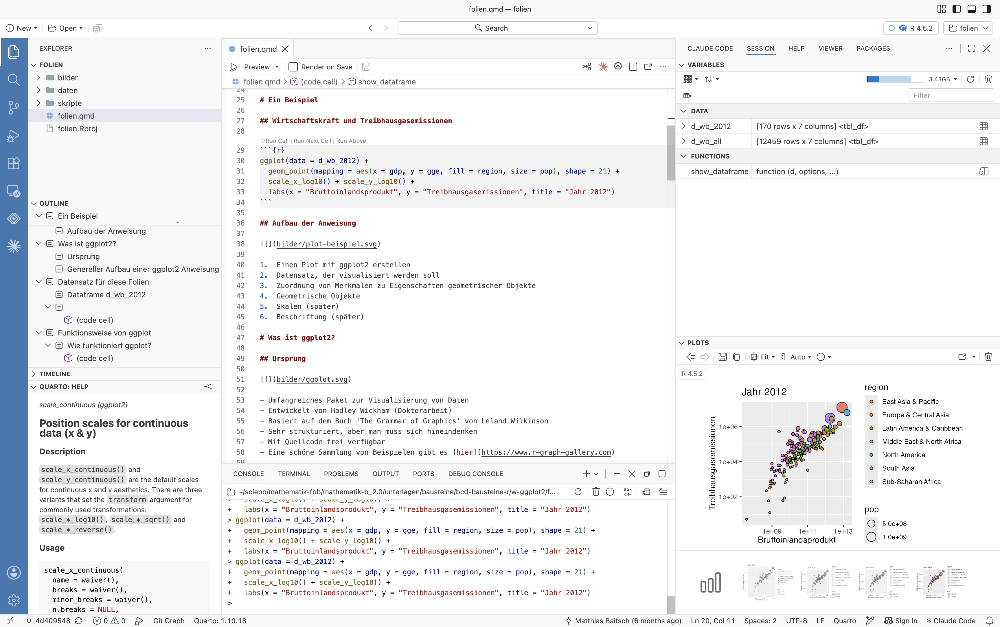

```{r}
#| include: false
library(gt)
library(sf)
library(rdwd)
library(giscoR)
library(ggridges)
library(patchwork)
library(tidyverse)
library(reticulate)

py_require(python_version = ">=3.11")
py_require(c("matplotlib", "pandas"))
Sys.setlocale("LC_ALL", "de_DE.UTF-8")
```

## 

::: {style="font-size: 1.75em"}
Herzlich willkommen, Welcome, Hoş geldiniz, أهلاً وسهلاً, Bi xêr hatin, Добро пожаловать, Witamy serdecznie, Benvenuti, Καλώς ήρθατε, Bienvenidos, Bienvenue, خوش آمدید, ښه راغلاست, Dobro došli, Bine ați venit, Chào mừng, 欢迎, स्वागत है, خوش آمدید, እንቋዕ ብደሓን መፁ
:::

## Agenda heute

- Teil 1: Über das Modul Mathematik B
    - Statistik und Datenanalyse
    - Praktische Anwendung auf dem Computer
    - Aufbau der Vorlesung und Prüfungsleistung

- Teil 2: Installation der Software und erste Schritte

# Statistik und Datenanalyse...



## Statistik {.smaller}

{}

- Beschreibende Statistik: Darstellen und Aufbereiten von empirischen Datensätzen als Entscheidungsgrundlage (zum Beispiel in der Politik)

- Explorative Statistik: Generieren von Annahmen und Hypothesen aus Daten, mit denen die Eigenschaften der Daten erklärt werden können

- Schließende Statistik: Ableiten von Aussagen über die Grundgesamtheit aus Daten; zentrales Hilfsmittel dabei ist die Wahrscheinlichkeitstheorie (schätzen, testen, modellieren)

## Datenanalyse

{}

In der Datenanalyse wird mit statistischen Methoden gearbeitet, mit welchen aus vorliegenden numerischen Einzeldaten zusammenfassende Informationen (Kenngrößen) gewonnen und tabellarisch oder grafisch aufbereitet und dokumentiert werden. (Wikipedia)

- Daten einlesen, aufbereiten, analysieren, darstellen und kommunizieren

- Querschnittsdisziplin zwischen Statistik und Informatik

- Vereinfacht gesagt: Statistik auf dem Computer

## Im Bau- und Umweltingenieurwesen {.smaller}

::: {layout-ncol=4}

{}

{}

{}

{}

:::

a) Ermittlung und Aufbereitung von Daten als Grundlage für die Planung der Verkehrsinfrastruktur.

a) Prognose der Häufigkeit und des Ausmaßes zukünftiger Starkregenereignisse auf Basis von Aufzeichnungen. Entwicklung stochastischer Modelle für fließende Gewässer.

a) Entwicklung und Anwendung probabilistischer Sicherheitskonzepte, die streuenden Materialparametern und unsicheren Einwirkungen Rechnung tragen.

a) Messwerte einer Versuchsreihe zu Stahlbetondecken. Offensichtlich streuen die Messwerte stark.

# Praktische Anwendung auf dem Computer...

## Tabellenkalkulation

  {}

- Geeignet für einfache Fragestellungen 
- Man muss nichts grundsätzlich Neues lernen
- Häufig unhandlich und umständlich in der Anwendung

## Exkurs Excel 1/2

{}

Wolfgang Schäuble zum „Wall Street Journal“ auf die Frage, ob der Europäische Fiskalpakt Konjunkturpakete gegen die Rezession verbieten will: „Wir haben sehr sorgfältig die Untersuchung von Rogoff und Reinhart gelesen. Sie haben empirisch belegt, dass ab einem bestimmten Grad eine zu hohe Staatsverschuldung das Wachstum beeinträchtigt.“

## Exkurs Excel 2/2

{}

- Google-Suche: The Excel error that changed history 
- <https://de.wikipedia.org/wiki/Kenneth_S._Rogoff>

## SPSS – Statistical Package for the Social Sciences

{}

- Umfangreiches Statistikpaket
- Weit verbreitet in Wirtschafts- und Sozialwissenschaften, Medizin
- Komfortabel in der Anwendung, aber eher unflexibel
- Teuer

##

::: {.panel-tabset}

## Programmiersprache Python

```{python}
#| echo: true
#| message: false
#| code-fold: true
#| code-line-numbers: true
import pandas as pd
import matplotlib.pyplot as plt

df = pd.read_csv(
    "daten/6342800.day",
    sep=";",
    comment="#",
    encoding="windows-1252",
    skipinitialspace=True,
    parse_dates=["YYYY-MM-DD"]
)

df["monat"] = df["YYYY-MM-DD"].dt.month
df_summary = df.groupby("monat")["Original"].agg(
    mittelwert="mean", min="min", max="max"
)
x = df_summary.index
y = df_summary["mittelwert"]
yerr = [y - df_summary["min"], df_summary["max"] - y]
monate = ("Jan", "Feb", "Mär", "Apr", "Mai", "Jun", "Jul", "Aug", "Sep", "Okt", "Nov", "Dez")

plt.grid()
plt.bar(x, y)
plt.errorbar(x, y, yerr=yerr, fmt='none', ecolor='black', capsize=10)
plt.title(
    "Abfluss der Donau am Pegel Hofkirchen\n"
    "Monatliche Mittel- und Extremwerte"
)
plt.xlabel("Monat")
plt.ylabel("Abfluss in m³/s")
plt.xticks(ticks=x, labels=monate);
plt.show()
```

##  Programmiersprache R

```{r}
#| echo: true
#| warning: false
#| code-fold: true
#| code-line-numbers: true
library(tidyverse)

d <- read_delim(
  "daten/6342800.day",
  delim = ";",
  comment = "#",
  trim_ws = TRUE
) |>
  mutate(monat = month(`YYYY-MM-DD`, label = TRUE)) |>
  group_by(monat) |>
  summarise(
    mittelwert = mean(Original),
    min = min(Original),
    max = max(Original)
  )

ggplot(data = d) +
  geom_col(mapping = aes(x = monat, y = mittelwert)) +
  geom_errorbar(mapping = aes(x = monat, ymin = min, ymax = max)) +
  labs(
    x = "Monat",
    y = "Abfluss in m³/s",
    title = "Abfluss der Donau am Pegel Hofkirchen",
    subtitle = "Monatliche Mittel- und Extremwerte"
  )
```

:::

## Mathematik B: Quarto, R und Positron {.smaller}

{}

- Quarto: System zur Erstellung von Dokumenten mit Text und Programmcode
- R: Aufbereitung von Daten und Plotten komfortabler als in Python
- Positron: Grafische Umgebung für Quarto und R
- Sehr mächtig, aber erfordert Einarbeitung
- Frei verfügbar

$\rightarrow$ So wenig Informatik wie möglich!

# Aufbau der Vorlesung und Prüfungsleistung...

## Aufbau der Vorlesung

{}

### Inverted Classroom

- Erklärvideos zu den Inhalten zu Hause anschauen
- Neue Videos werden jeweils bis Ende der Woche freigeschaltet
- Fragen diskutieren, Aufgaben lösen und „echte“ Daten analysieren in Präsenz

## Prüfungsleistung

- Hausarbeit mit mündlicher Prüfung
  - Form: Schriftliche Ausarbeitung oder Präsentation
- Themen aus den Bereichen Konstruktiver Ingenieurbau, Wasser und Verkehr
    - Ausgabe Ende des Jahres
- Eigene Themen sind möglich
- Betreuung durch mich und die Fachkolleg:innen

## Was ändert sich gegenüber den letzten Jahren?

- Positron statt RStudio
- Wir werden explizit KI nutzen
  - Wichtig: Erst Grundprinzipien verstehen, dann sich von KI helfen lassen
- Zusätzlich Wahrscheinlichkeitsrechnung und schließende Statistik
- Mündliche Prüfung umfasst jetzt Mathematik und R

# Installation der Software und erste Schritte...

## Aufgaben

- R und Positron installieren (Anleitung auf Moodle)

- Folien herunterladen und in Positron öffnen
    - Zip-Datei [01-erste-schritte.zip](../folien-r/c/01-erste-schritte.zip) herunterladen
    - In Ordner `studium/mathematik-b/folien-r/` entpacken
    - Datei erste-schritte.code-workspace in Positron öffnen
    - Datei `erste-schritte.qmd` in Positron anschauen
    - Gemeinsam durchgehen